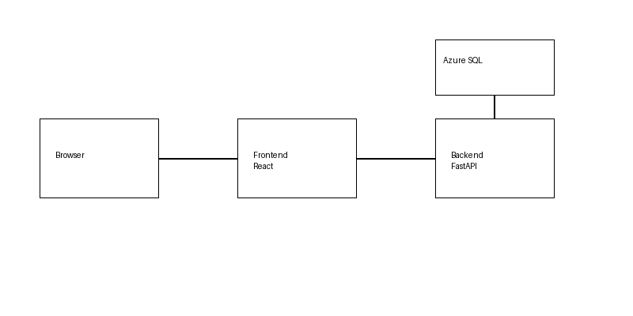

# SQL Wait Stats Dashboard


---

## Architecture Diagram



<pre>Browser (localhost:5173)
↓
Frontend (React + Vite)
↓
(/api proxy)
Backend API (FastAPI :3001)
↓
Azure SQL Database (DMVs)
</pre>
---


- Containers communicate over an internal Docker network
- Exposed locally via:
  - Frontend: http://localhost:5173
  - Backend API: http://localhost:3001

---

## 📁 Project Structure

<pre>sql-wait-dashboard/
├── docker-compose.yml
├── .env # DO NOT COMMIT
├── .gitignore
├── backend/
│ ├── Dockerfile
│ ├── server.py
│ ├── db.py
│ ├── queries.py
│ └── requirements.txt
└── frontend/
├── Dockerfile
├── package.json
├── vite.config.js
└── src/</pre>

---

## ⚙️ Prerequisites

- Windows 10/11 with WSL2
- Ubuntu 24.04 (WSL2)
- Docker Desktop (WSL2 backend enabled)
- Azure SQL Database

Minimum recommended:

- 4GB RAM allocated to Docker

---

## 🔐 Environment Configuration

Create a `.env` file in the project root:

<pre>
DB_SERVER=your-server.database.windows.net
DB_NAME=your-database
DB_USER=dashboard_reader
DB_PASSWORD=YourPassword
DB_PORT=1433

API_PORT=3001
VITE_PORT=5173
</pre>
⚠️ Never commit .env to source control.

🐳 Running the Application

1. Build containers
    docker compose build
2. Start services
    docker compose up -d
3. Verify
    docker compose ps

🌐 Access the App
Dashboard UI:
http://localhost:5173
API Docs (Swagger):
http://localhost:3001/docs
Health Check:
http://localhost:3001/api/health

🔍 Features

- Wait Statistics
- Aggregated wait types
- Categorization:
- CPU
- IO
- Memory
- Other
- Active Requests
- Session-level visibility
- Blocking detection
- Current executing SQL

🧠 How It Works

The backend queries Azure SQL DMVs:

sys.dm_os_wait_stats
sys.dm_exec_requests

Data is:

1. Retrieved via pyodbc
2. Transformed in FastAPI
3. Returned as JSON
4. Rendered in React charts

🔑 Azure SQL Setup
Create login
    CREATE USER [dashboard_reader]
    WITH PASSWORD = 'YourPassword';

    GRANT VIEW DATABASE STATE TO [dashboard_reader];

Firewall
    Add your client IP in Azure Portal

🔄 Development Workflow
Backend changes
    docker compose restart backend
Frontend changes
    Hot reload enabled (no restart needed)

🛠 Useful Commands
    docker compose up -d              # Start
    docker compose down              # Stop
    docker compose logs -f           # Logs
    docker compose restart backend   # Restart API
    docker compose build --no-cache  # Rebuild

⚠️ Common Issues

    * Issue Fix
    * Cannot connect to DB    -> Check firewall + credentials
    * Backend crashes         -> Check logs: docker compose logs backend
    * No data                 -> Ensure DMV permissions
    * Frontend blank          -> Verify API proxy config
    * Port conflicts          -> Check ports 5173 / 3001

🔒 Security Notes

    Uses SQL authentication via .env

    For production, consider:

        - Azure Managed Identity
        - Private endpoints
        - Secrets management (Key Vault)

📈 Future Enhancements

    - Historical trend storage
    - Alerting thresholds
    - Authentication layer
    - Deployment to Azure (App Service / Container Apps)

🧑‍💻 Tech Stack

    - React 18
    - Vite
    - FastAPI
    - pyodbc
    - Docker Compose
    - Azure SQL

📄 License

    Internal / Private Project

💡 Final Notes

    This project is intentionally designed to be:

    - Lightweight
    - Local-first
    - Easy to deploy
    - Production-extensible

If you're running into issues, start with:

docker compose logs -f

That will tell you almost everything you need to know.

## Overview
A full-stack dashboard for analyzing SQL Server wait statistics in real time.

## Stack
- React + Vite
- FastAPI
- Docker Compose
- Azure SQL

## Run
```bash
docker compose build
docker compose up -d
```

## Access
- http://localhost:5173
- http://localhost:3001/docs
